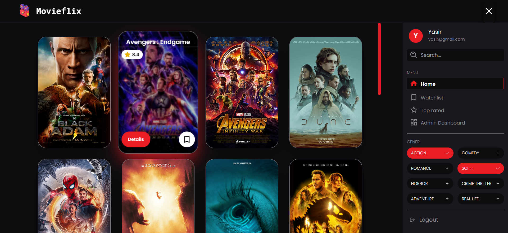
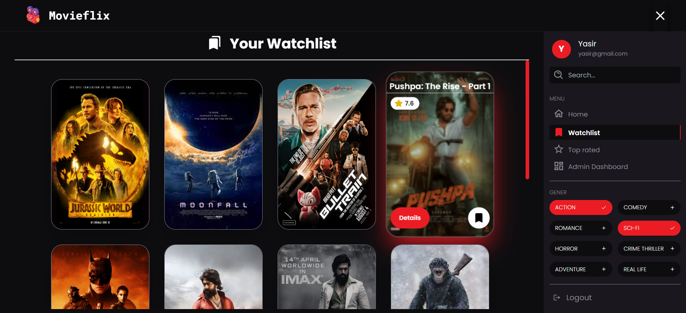
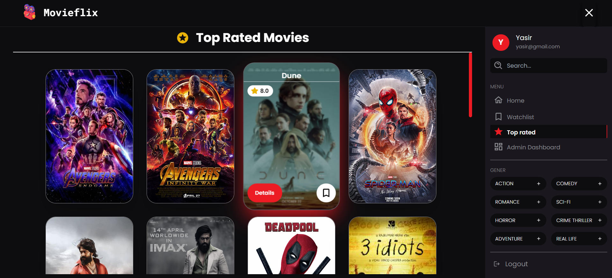
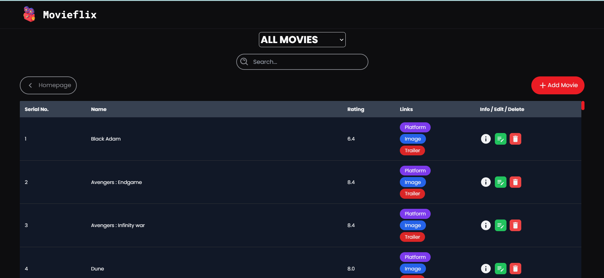
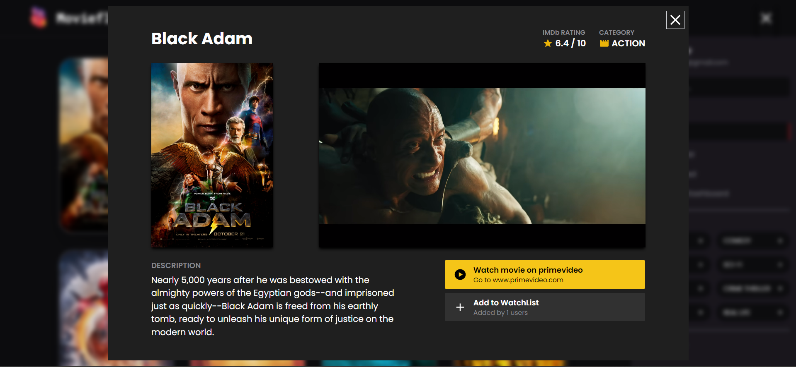
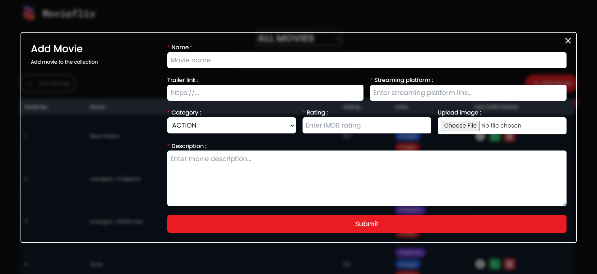
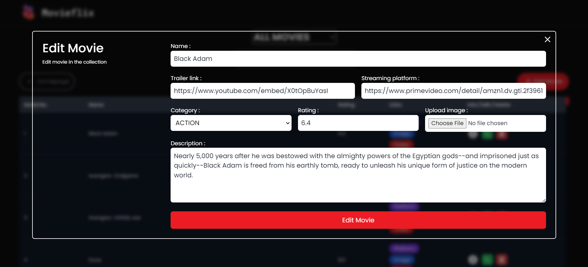

# Movieflix app

- This is a internship project. In this project I have made a **Movieflix App** with MERN, which reccomends you movies based on selected categories which contains movie streaming platform link, trailer, description, IMDb rating and you can add movies to your watch list.

- I have hosted this website on Netlify, please find the link below:

  

- Click the link below to see backend repository:

  

---

## 🚀 Features

- Authentication.
- Admin section which can add, delete and update movies.
- Add movies to your watchlist.
- You can see movie trailer, description, IMDb rating and movie platform.
- Responsive for small and medium screens.
- It reccomends movies based on selected categories.
- You can also search movies based on movie name.

---

## 🛠 Skills learned

- To use mongodb and mongoose.
- To use react router dom.
- To use react hooks.
- To deploy backend.

---

## 💻 Technologies used

- React.js for frontend.
- React router dom for client side routing.
- Express.js and Node.js for backend.
- mongoose and mongodb for database.
- Framer motion for some animations.

---

## 🎥 Screenshot

- Home page
  

- Watchlist section
  

- Toprated section
  

- Admin section
  

- Movie details modal
  

- Add movie modal
  

- Edit movie modal
  

---

## 👨‍💻 About Me

### Hey, I am Yasir lambawala

- I am a fullstack Javascript web developer with proficiency in frontend from Gujarat. I have done my Btech at GTU university and I am currently exploring backend-development.

- Connect with me on:
  - [Linkedin](https://www.linkedin.com/in/yasir-lambawala-2b216a1b9/)
  - [Instagram](https://www.instagram.com/web_dev_yasir/)

---

## Feedback

- If you have any feedback, please reach me at lambawalay@gmail.com
